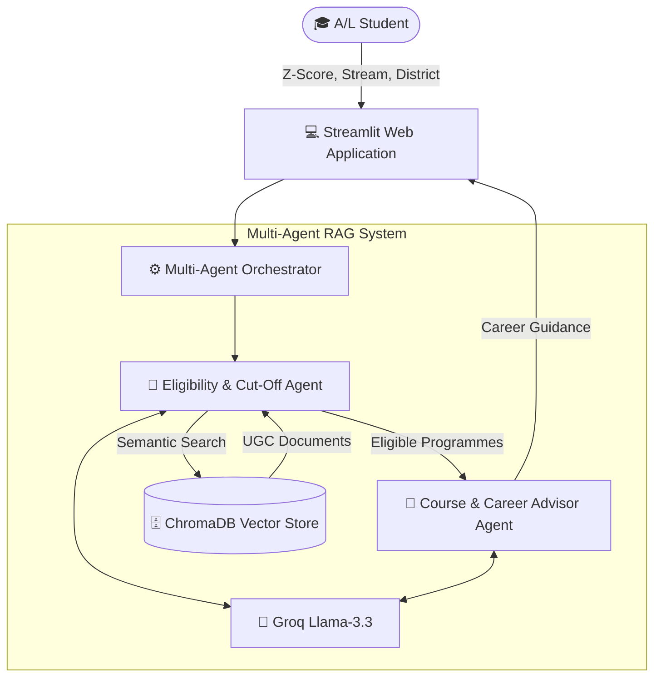

# 🎓 LankaCampus Navigator

> **An AI-Powered Multi-Agent RAG System for Sri Lankan State University Selection & Career Guidance**

LankaCampus Navigator is an intelligent web application designed to help Sri Lankan G.C.E. Advanced Level students identify suitable state university degree programmes based on their **Z-Score, A/L stream, and district**.

The system provides personalised university selection and career guidance using the latest **University Grants Commission (UGC) admission guidelines**.

Powered by a **Multi-Agent Retrieval-Augmented Generation (RAG)** architecture using **LangChain, ChromaDB, FastEmbed, and Groq Llama-3.3**, the platform delivers accurate eligibility analysis together with strategic academic and career recommendations.

---

## 🔗 Links

🚀 **Live Application:**  
https://lankacampus-navigator.streamlit.app

📁 **GitHub Repository:**  
https://github.com/dilsharadissanayake0-dev/LankaCampus-Navigator

---

# 📌 Overview

Every year, thousands of Sri Lankan A/L students struggle to understand the complex UGC Admission Handbook and determine which university degree programmes they qualify for.

**LankaCampus Navigator** simplifies this process by:

- 🎯 Identifying eligible state university degree programmes
- 📊 Comparing student Z-Scores with official district cut-off marks
- 🎓 Suggesting suitable degree pathways
- 💼 Providing career opportunities related to selected degrees
- ⚠️ Highlighting programmes requiring aptitude tests

Instead of manually searching hundreds of pages of UGC documents, students can receive instant AI-powered recommendations through an interactive web application.

---

# ✨ Key Features

- 🤖 Multi-Agent AI Architecture
- 📚 Retrieval-Augmented Generation (RAG)
- 🔍 Semantic Search using ChromaDB
- 🎓 University Eligibility Analysis
- 📈 Z-Score Cut-off Comparison
- 💼 Degree & Career Recommendations
- ⚠️ Aptitude Test Notifications
- 🌐 Interactive Streamlit Interface

---

# 🏛️ System Architecture



---

# 🔄 Multi-Agent Workflow & Design Patterns

The system follows a sequential multi-agent workflow implementing several Agentic AI design patterns.

---

## 🤖 Agent 1 – Eligibility & Cut-Off Agent

### Responsibilities

- Accepts student information:
  - Z-Score
  - A/L Stream
  - District

- Performs semantic search using ChromaDB
- Retrieves relevant UGC admission information
- Compares student results against district cut-off marks
- Filters eligible degree programmes
- Generates structured eligibility results

### AI Design Patterns

| Pattern | Usage |
|---|---|
| Tool-Use Pattern | Uses ChromaDB retrieval tools for document searching |
| ReAct Pattern | Performs reasoning and action-based evaluation |
| RAG Integration Pattern | Generates grounded responses using retrieved context |

---

# 🤖 Agent 2 – Course & Career Advisor Agent

### Responsibilities

- Receives eligible programmes from Agent 1
- Explains degree areas and subject focus
- Provides career pathways
- Suggests industry opportunities
- Identifies mandatory aptitude tests
- Provides strategic UGC preference ordering advice

### AI Design Patterns

| Pattern | Usage |
|---|---|
| Synthesis Pattern | Converts course information into career guidance |
| Sequential Orchestrator Pattern | Receives and processes Agent 1 output |

---

# ⚡ Model Choice Comparison & Justification

| Task | Selected Model | Reason |
|---|---|---|
| Document Embedding | BAAI/bge-small-en-v1.5 (FastEmbed) | Fast local embedding with low latency and high semantic accuracy |
| Eligibility Reasoning | Llama-3.3-70B-Versatile (Groq) | High reasoning capability for cutoff comparison |
| Career Guidance Generation | Llama-3.3-70B-Versatile (Groq) | Strong contextual understanding and synthesis |

---

# 🛠️ Technology Stack

| Category | Technology |
|---|---|
| Programming Language | Python 3.10+ |
| AI Framework | LangChain |
| Multi-Agent Architecture | LangChain Agents / Sequential Chains |
| Large Language Model | Groq Llama-3.3-70B-Versatile |
| Embedding Model | BAAI/bge-small-en-v1.5 |
| Embedding Library | FastEmbed |
| Vector Database | ChromaDB |
| Frontend | Streamlit |
| Environment Management | python-dotenv |
| Version Control | Git & GitHub |

---

# 🔍 RAG Pipeline Workflow

### 1. Document Processing

Official UGC admission documents are processed using:

- RecursiveCharacterTextSplitter
- Chunk Size: 500
- Chunk Overlap: 50

### 2. Embedding Generation

Document chunks are converted into vectors using:

```
BAAI/bge-small-en-v1.5
```

### 3. Vector Storage

Generated embeddings are stored in:

```
ChromaDB
```

### 4. Retrieval

Student inputs trigger semantic similarity search to retrieve relevant UGC information.

### 5. Multi-Agent Processing

```
Student Input
      |
      ↓
Eligibility Agent
      |
      ↓
Course & Career Agent
      |
      ↓
Final Recommendation
```

---

# 📂 Project Structure

```
LankaCampus-Navigator/

│
├── app.py
├── requirements.txt
├── README.md
├── .env
│
├── chroma_db/
│
├── data/
│   ├── ugc_handbook.pdf
│   └── processed_documents/
│
├── src/
│   ├── generate_docs.py
│   ├── rag_pipeline.py
│   ├── agents.py
│   ├── prompts.py
│   ├── vector_store.py
│   └── utils.py
│
└── assets/
```

---

# 🚀 Installation & Local Setup Guide

## 1. Clone Repository

```bash
git clone https://github.com/dilsharadissanayake0-dev/LankaCampus-Navigator.git

cd LankaCampus-Navigator
```

---

## 2. Create Virtual Environment

### Windows

```bash
python -m venv venv

venv\Scripts\activate
```

### Linux / macOS

```bash
python3 -m venv venv

source venv/bin/activate
```

---

## 3. Install Dependencies

```bash
pip install -r requirements.txt
```

---

## 4. Configure Environment Variables

Create a `.env` file in the project root:

```env
GROQ_API_KEY=your_actual_groq_api_key_here
```

---

# ▶️ Running the Application

## Step 1: Build Knowledge Base

```bash
python src/rag_pipeline.py
```

This creates the ChromaDB vector database.

---

## Step 2: Start Streamlit Application

```bash
python -m streamlit run app.py
```

The application will open in your browser.

---

# ⚠️ Known Limitations

- The knowledge base depends on the UGC handbook version stored in `data/`.
- Annual Z-Score updates require rebuilding the ChromaDB index.
- Groq API availability depends on usage limits and service availability.

---

# 👨‍💻 Developed By

**Dilshara Dissanayake**  
ITBIN-2313-0030  
Intake 13

---