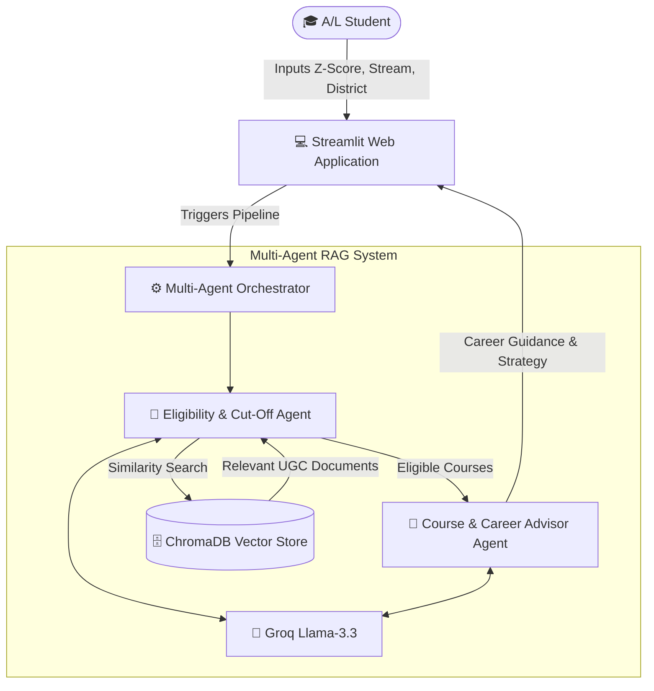

# 🎓 LankaCampus Navigator

> **An AI-Powered Multi-Agent RAG System for Sri Lankan State University Selection & Career Guidance**

LankaCampus Navigator is an intelligent web application that helps Sri Lankan G.C.E. Advanced Level students identify eligible state university degree programmes based on their **Z-Score, A/L stream, and district**, while also providing personalised career guidance according to the latest **University Grants Commission (UGC)** admission guidelines.

The system leverages a **Multi-Agent Retrieval-Augmented Generation (RAG)** architecture powered by **LangChain**, **ChromaDB**, and **Groq Llama-3.3**, enabling students to receive accurate university eligibility results together with strategic academic and career recommendations.

---

# 📌 Overview

Every year, thousands of Sri Lankan A/L students find it difficult to navigate the lengthy UGC Admission Handbook to determine which university degree programmes they qualify for.

**LankaCampus Navigator** simplifies this process by:

- 🎯 Identifying eligible state university degree programmes
- 📊 Comparing student Z-Scores against official district cut-off marks
- 🎓 Recommending suitable degree pathways
- 💼 Providing career guidance based on selected programmes
- ⚠️ Informing students about required Aptitude Tests where applicable

Instead of manually searching hundreds of pages in the UGC handbook, students receive instant AI-powered recommendations through a simple web interface.

---

# ✨ Key Features

- 🤖 Multi-Agent AI Architecture
- 📚 Retrieval-Augmented Generation (RAG)
- 🔍 Semantic Search using ChromaDB
- 🎓 University Eligibility Prediction
- 📈 Official Z-Score Cut-off Comparison
- 💼 Degree & Career Recommendations
- ⚠️ Aptitude Test Notifications
- 🌐 Interactive Streamlit Web Application

---

# 🏛️ System Architecture



---

# 🔄 Multi-Agent Workflow

The system follows a sequential multi-agent workflow where each AI agent performs a specialised task.

## 🤖 Agent 1 – Eligibility & Cut-Off Agent

### Responsibilities

- Accepts the student's:
  - Z-Score
  - A/L Stream
  - District
- Performs semantic similarity search on ChromaDB.
- Retrieves relevant UGC admission data.
- Compares the student's Z-Score with official district cut-off marks.
- Filters out ineligible degree programmes.
- Produces a structured list of eligible state university courses.

### AI Pattern

- Tool-Use
- ReAct Pattern
- Retrieval-Augmented Generation (RAG)

---

## 🤖 Agent 2 – Course & Career Advisor Agent

### Responsibilities

Receives the eligible degree programmes generated by Agent 1 and:

- Explains each degree programme.
- Highlights important subject modules.
- Suggests suitable career pathways.
- Recommends future industry opportunities.
- Alerts students about mandatory Aptitude Tests (e.g., Architecture, Translation Studies).
- Suggests strategic university preference ordering during UGC applications.

### AI Pattern

- Multi-Agent Synthesis Pattern

---

# 🛠️ Technology Stack

| Category | Technology |
|-----------|------------|
| Programming Language | Python 3.10+ |
| AI Framework | LangChain |
| Multi-Agent Architecture | LangChain Agents |
| Large Language Model | Groq (Llama-3.3-70B-Versatile) |
| Embedding Model | BAAI/bge-small-en-v1.5 |
| Embedding Library | FastEmbed |
| Vector Database | ChromaDB |
| Frontend | Streamlit |
| Environment Variables | python-dotenv |
| Version Control | Git & GitHub |

---

# 📂 Project Structure

```text
LankaCampus-Navigator/
│
├── app.py
├── requirements.txt
├── README.md
├── .env
│
├── chroma_db/
│
├── data/
│   ├── ugc_handbook.pdf
│   └── processed_documents/
│
├── src/
│   ├── generate_docs.py
│   ├── rag_pipeline.py
│   ├── agents.py
│   ├── prompts.py
│   ├── vector_store.py
│   └── utils.py
│
└── assets/
```

---

# 🚀 Installation Guide

## 1. Clone the Repository

```bash
git clone https://github.com/dilsharadissanayake0-dev/LankaCampus-Navigator.git

cd LankaCampus-Navigator
```

---

## 2. Create a Virtual Environment

### Windows

```bash
python -m venv venv

venv\Scripts\activate
```

### Linux / macOS

```bash
python3 -m venv venv

source venv/bin/activate
```

---

## 3. Install Dependencies

```bash
pip install -r requirements.txt
```

---

# 🔑 Environment Variables

Create a `.env` file in the project root directory.

```env
GROQ_API_KEY=your_actual_groq_api_key_here
```

---

# ▶️ Running the Project

## Step 1 – Generate the UGC Knowledge Corpus

```bash
python src/generate_docs.py
```

---

## Step 2 – Build the ChromaDB Knowledge Base

```bash
python src/rag_pipeline.py
```

---

## Step 3 – Launch the Streamlit Application

```bash
python -m streamlit run app.py
```

---

# 🧪 Sample Test Case

### Student Profile

| Field | Value |
|-------|-------|
| Z-Score | **1.75** |
| Stream | **Physical Science** |
| District | **Colombo** |

---

## 🤖 Agent 1 Output

Eligible Degree Programmes

- BSc in Software Engineering – University of Kelaniya
- BSc Applied Sciences – University of Sri Jayewardenepura
- Additional eligible programmes based on official UGC cut-off marks

---

## 🤖 Agent 2 Output

Career Recommendations

- Software Engineer
- Full Stack Developer
- DevOps Engineer
- Cloud Engineer

Additional Guidance

- Strategic UGC application preference ordering
- Degree overview and subject modules
- Notifications about any required Aptitude Tests

---

# 🔍 How the RAG Pipeline Works

1. UGC admission handbook is processed into structured documents.
2. Documents are converted into embeddings using **FastEmbed (BAAI/bge-small-en-v1.5)**.
3. Embeddings are stored in **ChromaDB**.
4. Student queries are converted into semantic embeddings.
5. Relevant admission information is retrieved using similarity search.
6. Agent 1 evaluates university eligibility.
7. Agent 2 generates personalised academic and career guidance.
8. Results are displayed through the Streamlit interface.

---

# 🎯 Future Improvements

- Support for updated annual UGC handbooks
- Sinhala and Tamil language support
- University programme comparison
- Career salary insights
- Scholarship recommendations
- Export results as PDF
- Voice-enabled AI assistant

---

# 👨‍💻 Developed By

**Dilshara Dissanayake** 
**ITBIN-2313-0030**
**Intake 13**

---

